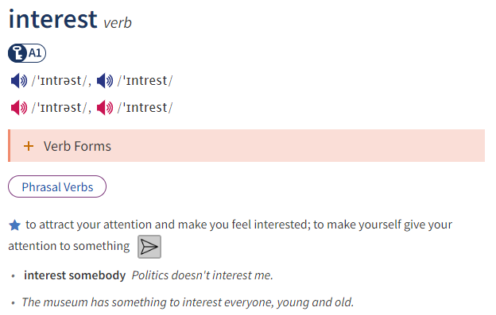
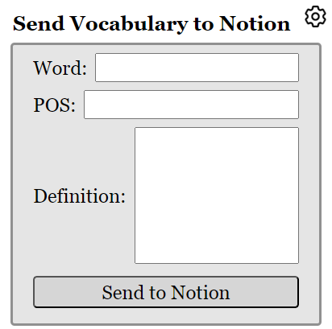
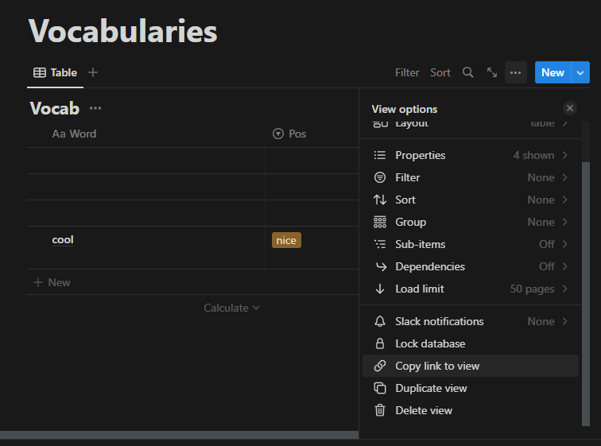

The Plugin allows adds a button to the Oxford learner's dictionary page and allows you to send the data of the vocabulary to Notion.

You can also add your own vocabularies from the popup.

How to install:
1. Download the source code
2. At the extensions tab, click on manage extensions
3. Turn on the Developer mode toggle
4. Choose Load Unpack option and navigate to the folder where the extension is stored
Setup:
1. Create an Notion Integration:
[Notion's guide on how to create an integration](https://www.notion.so/help/create-integrations-with-the-notion-api)
2. Copy the Internal Integration Secret
3. Duplicate this database to your own Notion: https://electric-mice-3d7.notion.site/Vocabularies-5808944f5d7846eb8a72a148aef42052?pvs=4
4. Add the Notion Integration into your duplicated database: [Notion's guide on how to connect your integrations](https://www.notion.so/help/add-and-manage-connections-with-the-api#add-connections-to-pages)
5. Find the database ID:
[Notion's guide on how to find the database ID](https://developers.notion.com/reference/retrieve-a-database)

You could copy the link to view and find the Database ID.
6. Click on the settings Icon and navigate to the settings dashboard, on the left hand side you will find the settings tab, enter your KEY and Database ID
7. You're good to go!

Icons used are as below:

Send icon:
<a href="https://www.flaticon.com/free-icons/send" title="send icons">Send icons created by Becris - Flaticon</a>

Extension icon:
<a href="https://www.flaticon.com/free-icons/poop" title="poop icons">Poop icons created by Smashicons - Flaticon</a>

Settings icon:
<a href="https://www.flaticon.com/free-icons/settings" title="settings icons">Settings icons created by Freepik - Flaticon</a>

Email Icon:
<a href="https://www.flaticon.com/free-icons/email" title="email icons">Email icons created by Freepik - Flaticon</a>

Github Icon:
<a href="https://www.flaticon.com/free-icons/github" title="github icons">Github icons created by Freepik - Flaticon</a>

Linkedin Icon
<a href="https://www.flaticon.com/free-icons/linkedin" title="linkedin icons">Linkedin icons created by Freepik - Flaticon</a>

dashboard design:
https://www.codingnepalweb.com/responsive-side-navigation-bar-in-html-css-javascript/
